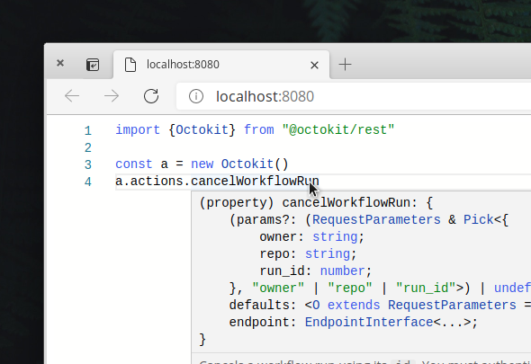

### Custom DTS files with TypeScript Sandbox




1. `scripts/makeDTSObj.mjs` - Recursively grabs all the @octokit/* files and puts them into a single JSON file which the browser can read

2. `index.html` - Differences from the demo code [on the site](https://www.typescriptlang.org/dev/sandbox/)
    - Uses `script:module` to pull in the JSON above
    - Loops through all those files and puts them into monaco's memory:
       ```ts
        const sb = sandboxFactory.createTypeScriptSandbox( sandboxConfig, main, window.ts);

        // Loop through the paths in the JSON file and add them to the monaco background workers
        Object.keys(dts).forEach((path) => {
          sb.languageServiceDefaults.addExtraLib( dts[path], "file:///" + path);
        });
       ```
    